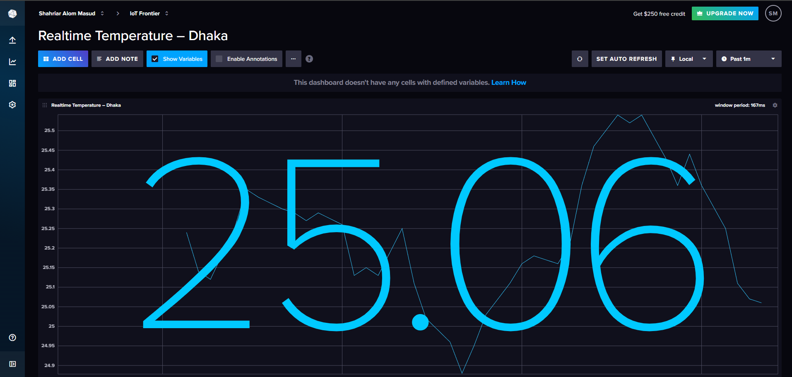
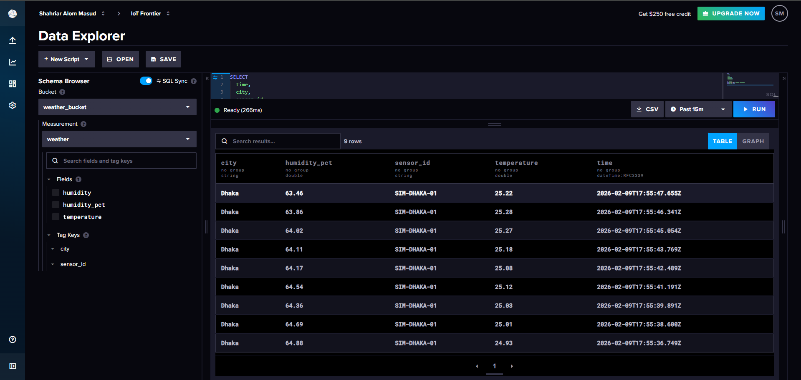
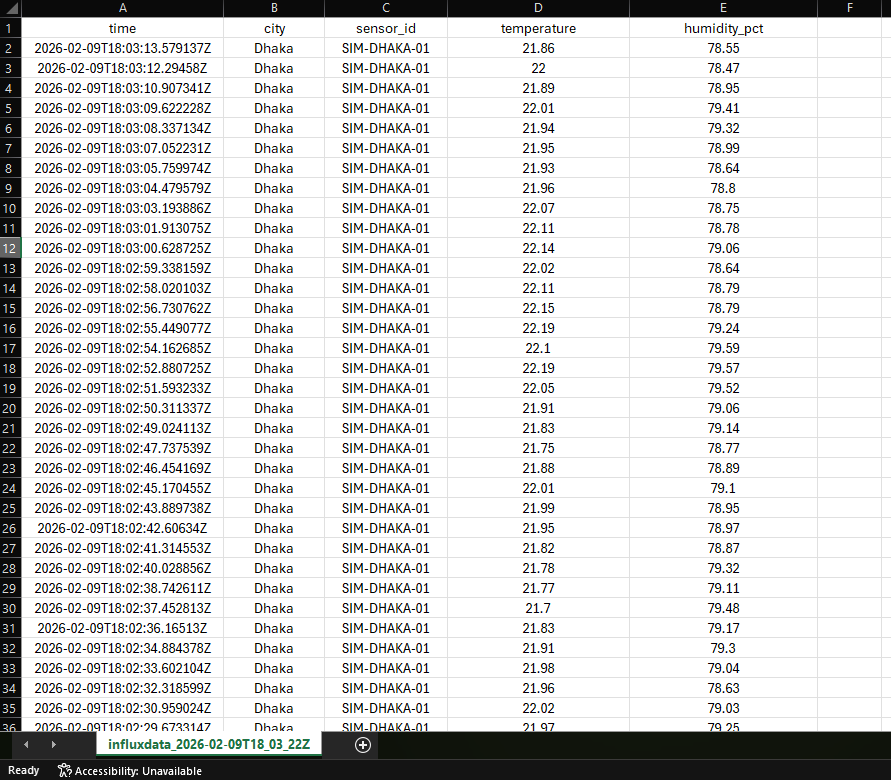

# IoT Realtime Weather Sensor Simulation using InfluxDB

A complete IoT-style realtime weather monitoring system built using Python + InfluxDB Cloud, simulating real sensor data and visualizing it with auto-refresh dashboards.

This project does NOT use physical sensors. Instead, it simulates realistic realtime sensor behavior (1-second interval), making it perfect for:

- IoT coursework
- Database & time-series learning
- Dashboard & monitoring demos
- Smart City / Weather analytics prototypes

---

## Features

- Realtime weather data simulation (1 sec interval)
- Time-series storage using InfluxDB Cloud
- Auto-refresh dashboards (like Google Sheets realtime view)
- CSV export support
- Clean & production-ready project structure
- Uses Open-Meteo API (optional mode)

---

## Project Structure

| Path / File | Description |
|------------|-------------|
| iot-realtime-weather-sensor-simulation-influxdb/ | Root project directory |
| data/ | Data storage folder |
| data/sample_export.csv | Sample exported CSV file |
| requirements/ | Dependency files |
| requirements/requirements.txt | Python dependencies |
| screenshots/ | Project screenshots |
| screenshots/CSV.png | CSV export preview |
| screenshots/dashboard.png | Realtime dashboard preview |
| screenshots/Database.png | InfluxDB database view |
| src/ | Source code |
| src/onemeteo_to_influx.py | Open-Meteo API to InfluxDB |
| src/realtime_sensor_to_influx.py | Realtime sensor simulation |
| src/test_auth.py | InfluxDB authentication test |
| src/test_influx_cloud.py | InfluxDB connection test |
| .gitignore | Git ignore rules |
| LICENSE (MIT) | License file |
| README.md | Project documentation |

---

## System Architecture

1. Realtime Sensor Simulation
   - Generates smooth temperature & humidity values every second
   - Mimics real IoT sensors

2. InfluxDB Cloud
   - Stores data in a time-series optimized database
   - Supports fast queries & dashboards

3. Visualization
   - Auto-refresh line charts
   - Table view (like Google Sheets)
   - CSV export

---

## Open-Meteo API (Optional)

This project also supports Open-Meteo API for real-world weather data.

API used:

https://api.open-meteo.com/v1/forecast

Used parameters:

- latitude
- longitude
- temperature (2m)
- relative humidity (2m)

This mode is optional and included for educational comparison.

---

## Dashboard Preview

### Realtime Graph

### Database Records

### CSV Export

---

## Installation

### 1 Clone Repository

git clone https://github.com/your-username/iot-realtime-weather-sensor-simulation-influxdb.git  
cd iot-realtime-weather-sensor-simulation-influxdb

### 2 Install Dependencies

pip install -r requirements/requirements.txt

### 3 Configure InfluxDB

Edit inside Python files:

INFLUX_URL = "https://your-region.aws.cloud2.influxdata.com"  
INFLUX_TOKEN = "YOUR_API_TOKEN"  
ORG = "Your_Org"  
BUCKET = "weather_bucket"

---

## Run Realtime Sensor Simulation

python src/realtime_sensor_to_influx.py

Inserts data every 1 second  
Works like a real IoT sensor

---

## Export Data

From InfluxDB UI:

- Data Explorer -> CSV -> Download

Or use provided sample:

data/sample_export.csv

---

## Test Scripts

| File Name                     | Purpose                      |
|------------------------------|------------------------------|
| `test_auth.py`               | Test InfluxDB authentication |
| `test_influx_cloud.py`       | Test DB connection           |
| `onemeteo_to_influx.py`      | Open-Meteo to InfluxDB       |
| `realtime_sensor_to_influx.py` | Sensor simulation          |

---

## License

This project is licensed under the MIT License.  
You are free to use, modify, and distribute it.

---

## Author

Shahriar Alom Masud  
B.Sc. Engg. in IoT & Robotics Engineering  
University of Frontier Technology, Bangladesh  
Email: shahriar0002@std.uftb.ac.bd  
LinkedIn: https://www.linkedin.com/in/shahriar-alom-masud

---

If you like this project

Give it a star on GitHub  
Use it in your coursework or portfolio
